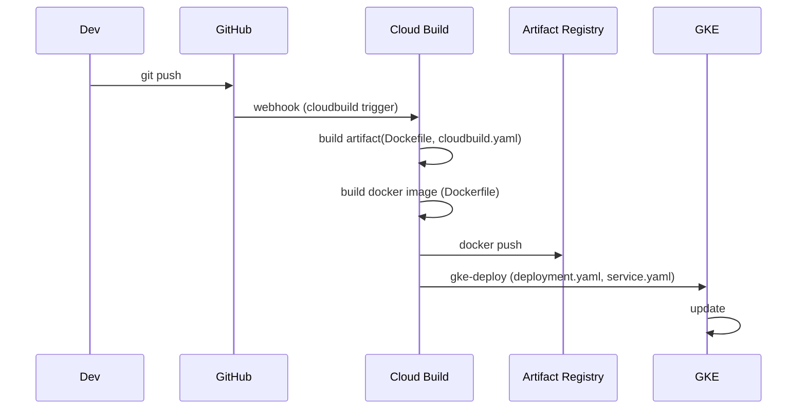

# 通过Github Repo 触发 Cloudbuild Trigger 完成 GKE 部署 

## 0. 概览



### 参与模块

- `Dev`：开发者，负责推送代码到GitHub。
- `GitHub`：代码仓库，接收代码推送并触发Webhook。
- `Cloud Build`：Google Cloud Platform上的服务，用于自动构建、测试和部署代码。
- `Artifact Registry`：Google Cloud上的服务，用于存储、管理和保护容器镜像。
- `GKE`：Google Kubernetes Engine，用于部署和管理容器化应用。

### 项目必备文件

1. `Dockerfile`：定义如何构建容器镜像的文件。
2. `cloudbuild.yaml`：Cloud Build的配置文件，指定构建步骤和触发器。
3. `deployment.yaml`：Kubernetes的部署配置文件，描述如何部署应用到GKE。
4. `service.yaml`：Kubernetes的服务配置文件，定义如何让外部可以访问应用。

## 1. 环境配置及准备工作

1. 安装 Google Cloud CLI：
    - 在 Mac OS 上安装 Google Cloud CLI 的详细步骤：
        - 下载并安装 Google Cloud SDK：https://cloud.google.com/sdk/docs/install
        - 配置 gcloud 命令行工具：https://cloud.google.com/sdk/docs/initializing

2. 安装 kubectl：
    - 在 Mac OS 上安装 kubectl 的步骤：
        - 使用 Homebrew 安装 kubectl：`brew install kubernetes-cli`

3. 利用 gcloud 获取集群权限：
    - 使用 gcloud 命令获取集群权限的步骤：
        - 运行命令：`gcloud container clusters get-credentials CLUSTER_NAME --zone ZONE`

4. 验证权限：
    - 使用 kubectl 命令验证权限：`kubectl get ns`

## 2. 必备文件概要

1. `cloudbuild.yaml`：
    - **作用**：Cloud Build 配置文件，定义了构建和部署流程。
    - **解释**：该文件指定了构建步骤、镜像的构建和推送方式，以及部署到 Kubernetes 集群的操作。

2. `deployment.yaml`：
    - **作用**：Kubernetes 部署配置文件，定义了应用程序的部署规范。
    - **解释**：该文件包含了容器部署的定义，包括副本数、容器镜像、环境变量等信息。

3. `service.yaml`：
    - **作用**：Kubernetes 服务配置文件，定义了应用程序的服务暴露规范。
    - **解释**：该文件定义了如何将应用程序暴露给集群内外的其他服务和用户，包括端口、负载均衡器配置等。

4. `Dockerfile`：
    - **作用**：Docker 镜像构建文件，定义了如何构建应用程序的容器镜像。
    - **解释**：该文件包含了构建容器镜像所需的指令，如基础镜像选择、依赖安装、代码复制等步骤。

## 3. 必备配置文件详解

### 镜像构建文件 (Dockerfile)

#### 1. 首先定义Dockerfile, 这里你需要定义项目构建制品的放置，暴露端口及启动命令等

```Dockerfile
FROM node:14

# 设置工作目录
WORKDIR /usr/src/app

# 拷贝 package.json 和 package-lock.json 到工作目录
COPY package*.json ./

# 安装依赖
RUN npm install

# 拷贝所有文件到工作目录
COPY . .

# 暴露端口 8080
EXPOSE 8080

# 启动应用程序
CMD [ "npm", "start" ]

```

#### 2.验证方式（可选）

打开终端，进入项目根目录，执行以下命令构建 Docker 镜像：

```shell
docker build -t my-node-app .
```

构建完成后，运行以下命令启动 Docker 容器并映射端口：

```shell
docker run -p 8080:8080 my-node-app
```

现在将可以在浏览器中访问 http://localhost:8080 来查看应用程序运行情况。

### 部署定义  (deployment.yaml)

#### 1. 定义Kubernetes集群内的deployment，以下是示例文件及说明

参考：[Deployment - Kubernetes 官方文档](https://kubernetes.io/docs/concepts/workloads/controllers/deployment/)

```yaml
apiVersion: apps/v1
kind: Deployment
metadata:
  name: helloworld-nodejs  # 部署的名称为 helloworld-nodejs
  namespace: prd  # 部署在 prd 命名空间中， 目前默认的生产环境ns(namespace)为prd
spec:
  replicas: 1  # 副本数为 1 以后需要多实例的时候可以变更为 N
  selector:
    matchLabels:
      app: helloworld-nodejs # 
  template:
    metadata:
      labels:
        app: helloworld-nodejs
    spec:
      serviceAccountName: blockchain-source-gke-prd  # 类似app engine的用法，需要提前联系运维定义.
      containers:
        - name: helloworld-nodejs
          image: gcr.io/arbitragescan/fake-app  # 占位镜像实际最终的结果会通过cloudbuild中的--image 更新
          ports:
            - containerPort: 8080  # 容器监听的端口为 8080
          livenessProbe: # livenesscheck不通过的时候会重启pod
            httpGet:
              path: /liveness_check
              port: 8080
            initialDelaySeconds: 120  # 初始延迟时间为 120 秒
            periodSeconds: 30  # 检测间隔时间为 30 秒
            failureThreshold: 6  # 失败阈值为 6
            successThreshold: 1  # 成功阈值为 1
          readinessProbe: # rediness不通过的时候不会承接流量，可以参考文档
            httpGet:
              path: /readiness_check
              port: 8080
            initialDelaySeconds: 120
            periodSeconds: 10
            failureThreshold: 2
            successThreshold: 1
          resources: # 这里定义了cpu 内存，request是最少要多少，limit是最多可以用到多少.
            requests:
              cpu: "1"  # 请求的 CPU 为 1 核心
              memory: "2Gi"  # 请求的内存为 2 GiB
            limits:
              cpu: "1"  # 最大 CPU 为 1 核心
              memory: "2Gi"  # 最大内存为 2 GiB

```

#### 2. 验证方式 (通过Dry run并不会真正的创建资源，要求完成kubectl配置)

```shell
kubectl apply -f deployment.yaml --dry-run=client
```

通过命令行返回判断是否正确定义deployment

### 服务暴露 (service.yaml)

#### 1.创建服务暴露，这步apply以后其实就已经又内部访问的service 方式了

```yaml
apiVersion: v1 # 指定Kubernetes API版本
kind: Service # 指定资源类型为Service
metadata:
  name: helloworld-nodejs # 服务的名称
  namespace: prd # 服务所属的命名空间为prd
spec:
  selector:
    app: helloworld-nodejs # 选择器，用于匹配Pod标签，将服务路由到匹配的Pod
  ports:
    - protocol: TCP # 指定协议为TCP
      port: 80 # 服务对外暴露的端口号
      targetPort: 8080 # Pod内部的目标端口号，服务将流量转发到此端口

```

#### 2. 验证方式 (通过Dry run并不会真正的创建资源，要求完成kubectl配置)

```shell
kubectl apply -f service.yaml --dry-run=client
```

通过观察返回，确定 service configured 即整个配置文件无误

### 构建配置文件 (cloudbuild.yaml)

#### 1. 定义构建文件，gcloud上定义好trigger，connect到对应的仓库，仓库的push触发cloudbuild按照配置文件构建

```yaml
substitutions:
  _IMAGE_NAME: 'gcr.io/arbitragescan/helloworld-nodejs:${SHORT_SHA}' # 自定义变量_IMAGE_NAME，用于指定镜像名称和标签

steps: # Cloud Build的步骤列表
  - name: 'node:14' # 使用node 14镜像作为构建环境
    entrypoint: 'bash' # 指定入口点为bash
    args:
      - '-c'
      - |
        npm install 
        npm run build 
  - name: 'gcr.io/cloud-builders/docker' # 使用docker构建器镜像
    args: [ 'build', '-t', '${_IMAGE_NAME}', '.' ] # 构建docker镜像并标记
    # 构建容器镜像
  - name: 'gcr.io/cloud-builders/docker' # 再次使用docker构建器镜像
    args: [ 'push', '${_IMAGE_NAME}' ] # 推送镜像到容器仓库
    # 将容器镜像推送到GKE
  - name: 'gcr.io/cloud-builders/gke-deploy' # 使用gke-deploy工具部署到GKE
    args:
      - run
      - --filename=deployment.yaml # 指定部署使用的配置文件
      - --image=${_IMAGE_NAME} # 指定部署的镜像
      - --location=us-central1 # 指定GKE集群的位置
      - --cluster=eigenphi-us-central-1 # 指定GKE集群的名称
  - name: 'gcr.io/cloud-builders/kubectl' # 使用kubectl工具应用Kubernetes配置
    args: [ 'apply', '-f', 'service.yaml' ] # 应用service.yaml中定义的服务配置
    env:
      - 'CLOUDSDK_COMPUTE_ZONE=us-central1' # 设置环境变量，指定计算区域
      - 'CLOUDSDK_CONTAINER_CLUSTER=eigenphi-us-central-1' # 设置环境变量，指定容器集群

```

#### 2. 验证方式 (通过Dry run并不会真正的创建资源，这里需要安装 cloud-build-local )

```shell
*** 安装 cloud-build-local ***

gcloud components install cloud-build-local

```

```shell
cloud-build-local --config=cloudbuild.yaml --dryrun=true .
```

## 4. 可观测性及内部服务访问方式

### 不具备kubectl权限

构建日志：[Cloud Build 管理面板](https://console.cloud.google.com/cloud-build/builds)

```text
1. 通过 Cloud Build 面板, 从History中选择构建历史可以看到完整的构建步骤
```

容器日志及指标监控：[GKE Workload 管理面板](https://console.cloud.google.com/kubernetes/workload/overview)

```text
1. 选择指定应用名称Workload
2. 在选项卡中选择 LOGS 进行日志查看
3. 在选项卡中选择 OBSERVABILITY 查看CPU 内存等指标监控情况 
```
内网服务访问: [Serice 管理面板](https://console.cloud.google.com/kubernetes/discovery)
```text
1. 在service面板中选择目前已经定义的service
2. 最下面部分点击  [PORT FORWARDING] 此时开启 cloudwatch 
3. 直接敲击回车进行转发
4. 转发完成后通过访问提供地址进行授权完成后即可访问
```


### 具备kubectl权限（参考1.4 进行配置）：

容器日志：

```text
1. $kubectl get pod
2. $kubectl logs -f SOMEPOD 
```
内网服务访问: 
```text
1. $kubectl proxy
2. 浏览器访问http://localhost:8001/api/v1/namespaces/[NAMESPACE]/services/[SERVICE_NAME]:[PORT_NAME]/proxy/
```
 

